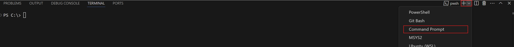
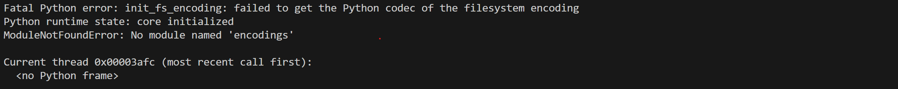

# Python Integration

To enable machine learning approaches, we have added the capability the bots to be [scripted in Python](#using-python) instead of in C. 

## Using Python

In order to use Python to script bots, you first need Python installed on your device. The installer can be downloaded from the [Python Website](https://www.python.org/downloads/).

### IMPORTANT

>For current BotStack events, we **strongly** suggest use of Python 3.10 to ensure compatbility of all scripts and any imported libraries. This specific version can be downloaded [here](https://www.python.org/downloads/release/python-3100/).
>
>If you already have a Python installation, you should either remove it, or ensure that your environment variables are set correctly to prioritise 3.10, at least for the terminal session you are building and running the program within. 

To check your install, open a terminal window, and run the following.

```
> python --version
```
> [SAMPLE OUTPUT] Python 3.10.11

You may need to use `python3` rather than `python` depending on your install.

Once the command runs, take note of the first two numbers (in the example, 3.10) - these will be important later.


### Fixing Install

If these do not work, then python is likely not added to your PATH. If this is the case, locate the folder where python was installed (i.e. where the python/python3 executable is located). Then run the following command in a terminal, replacing `<path>` (including the crocodiles) with the path you found, to append the location to the existing path. You will then need to restart the terminal for the change to take effect.

Note that `export`/`setx` are used to set the variable permanently. If you prefer, you can use `set` (for both systems), which will only set the variable for the current terminal session. This means for instance that you should run these commands from a terminal window, and then run all the build/run commands in the future also from that same terminal. If you restart the terminal, you will need to run these commands a second time. Obviously, in this case, restarting the terminal is *not* required for the change to be effective.

> If you are using the VSCode integrated terminal on Windows, it generally defaults to running Powershell. If this is the case, either, switch this to command prompt, or use the Powershell commands. However, note that for Powershell, <ins>permanently</ins> setting environment variables is much more involved, so the given commands only set them for that terminal session.



> Absence of spaces is important in these commands
```
[MAC]
> export PATH="$PATH":<path>

[WINDOWS - Command Prompt]
> setx PATH=%PATH%;<path>     (append)
> setx PATH=<path>            (set)
[WINDOWS - Powershell (including VSCode)]
> Env:PATH += <path>          (append)
> Env:PATH = <path>           (set)
```

You can check the variables were set correctly by running the following commands.

```
[MAC]
> echo $PATH

[WINDOWS - Command Prompt]
> echo %PATH%
[WINDOWS - Powershell]
> echo $Env:PATH
```

After doing this, you should be able to run the previous version command, and note the version numbers.

### Linking Python

To link python to the C program, you will need to modify the build command. 

Start by running the following commands in your terminal (again, replacing with `python3` if necessary).

```
[MAC]
> which -a python

[WINDOWS]
> where.exe python
```

This should list at least one folder path. Take the top one, which should end in `\bin`, and navigate to it in your file explorer. Then navigate up to the parent folder. This should contain two folders called `lib` folder and `include` (amongst some others). Both of these should in turn include a folder called `python<version>`, where `<version>` is the numbers you noted at the start.

> Continuing the example above, this would be `python3.10`.

The one in the `lib` folder should contain a bunch of .py files, and the one in the `include` folder should contain a bunch of .h files. <ins>Note down both of these paths.</ins>

Then go to the code, and find the file `_globals.h` in the `include/` folder. 
Change the line `#include <python3.10/Python.h>` to use the numbers you noted at the start in place of `3.10`.

Then, when building the code, add the following preprocessor define and linking arguments, in order to correctly link python to the generated executable.
```
 -DPYTHON_BOT -I"<include>" -L"<libraries>" -l"python<ver>"
```

- Replace `<include>` with the path of the `include` folder from above (including the include folder itself)
- Replace `<libraries>` with the path of the `lib` folder from above (including the lib folder itself)
- Replace `<ver>` with the version numbers from the start

### Issues

If the program builds, but throws an error when running, you may need to have the environment variables PYTHONPATH and PYTHONHOME set, depending on your installation of python.



These variables should be set to the parent folder of the folder you found when locating python (i.e. the folder which contained the `bin`, `include` and `lib` folders).

```
[MAC]
  export PYTHONPATH=<folder path>
  export PYTHONHOME=<folder path>

[WINDOWS - Command Prompt]
  setx PYTHONPATH=<folder path>
  setx PYTHONHOME=<folder path>
[WINDOWS - Powershell]
  Env:PYTHONPATH=<folder path>
  Env:PYTHONHOME=<folder path>
```
As before, we can set the variables locally with `set`, as opposed to globally - if you have more than one instance of python for instance, you should set these locally to avoid causing yourself issues in the future.